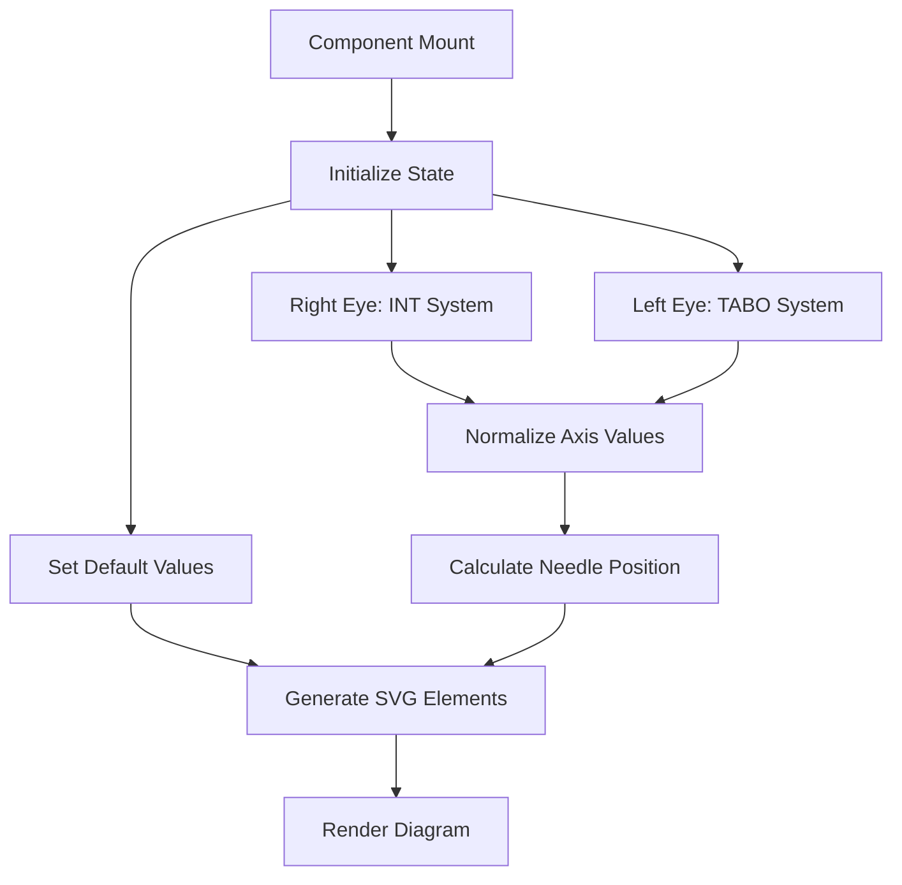
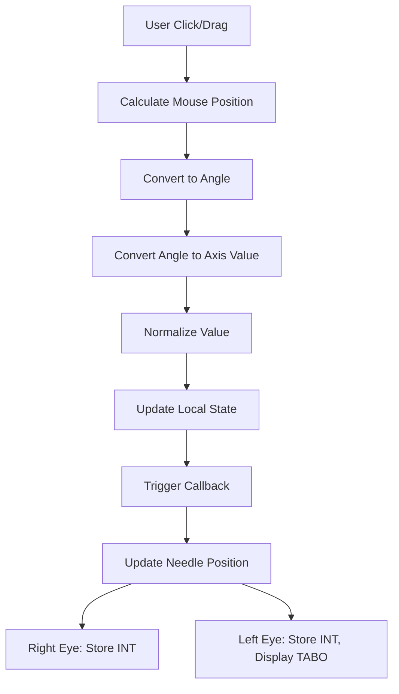

# Axis Diagram System - Complete Flow and Logic Documentation

## Overview

The Axis Diagram system is a sophisticated ophthalmic tool designed to visualize and interact with eye prescription axis values. The system supports both International (INT) and TABO notation systems, providing accurate representation for both right and left eye prescriptions.

## Architecture Overview

### Component Hierarchy

```
AxisDiagram System
├── EyeAxisDiagram (Main Component)
│   ├── Right Eye Diagram (International System)
│   └── Left Eye Diagram (TABO System)
├── AxisDiagram (Common Component)
│   └── Interactive Circular Protractor
└── AxisDiagramDemo (Demo Component)
    └── Interactive Demo with Controls
```

## Core Components

### 1. EyeAxisDiagram Component (`src/components/shop/EyeAxisDiagram.tsx`)

**Purpose**: Main component for displaying dual-eye axis diagrams with prescription inputs.

#### Key Features:
- **Dual Eye Support**: Separate diagrams for right and left eyes
- **System Compatibility**: Right eye uses International (INT), left eye uses TABO
- **Interactive Mode**: Click and drag to set axis values
- **Prescription Integration**: Full sphere, cylinder, and axis input support
- **Real-time Updates**: Live value updates during interaction

#### Props Interface:
```typescript
interface EyeAxisDiagramProps {
  rightEyeAxis?: number
  leftEyeAxis?: number
  rightEyePrescription?: PrescriptionValues
  leftEyePrescription?: PrescriptionValues
  compact?: boolean
  onRightEyeAxisChange?: (value: number) => void
  onLeftEyeAxisChange?: (value: number) => void
  onRightEyePrescriptionChange?: (prescription: PrescriptionValues) => void
  onLeftEyePrescriptionChange?: (prescription: PrescriptionValues) => void
  interactive?: boolean
}
```

### 2. AxisDiagram Component (`src/components/common/AxisDiagram.tsx`)

**Purpose**: Interactive circular protractor for axis selection.

#### Key Features:
- **Circular Design**: Full 360-degree protractor
- **Dual Arc System**: Green for positive (0-180°), red for negative (-180-0°)
- **Drag Interaction**: Click and drag needle for value selection
- **Visual Feedback**: Color-coded arcs and clear markings
- **Responsive Design**: Scalable size based on props

### 3. AxisDiagramDemo Component (`src/components/common/AxisDiagramDemo.tsx`)

**Purpose**: Demo component showcasing axis diagram functionality.

## System Logic Flow

### 1. Initialization Flow



### 2. Value Conversion Logic

#### International (INT) to TABO Conversion
```typescript
const taboToInt = (taboValue: number): number => {
  const normalized = normalizeAxis(taboValue)
  return 180 - normalized
}

// Examples:
// TABO 30 → INT 150
// TABO 120 → INT 60  
// TABO 100 → INT 80
```

#### TABO to International Conversion
```typescript
const intToTabo = (intValue: number): number => {
  const normalized = normalizeAxis(intValue)
  return 180 - normalized
}

// Examples:
// INT 150 → TABO 30
// INT 60 → TABO 120
// INT 80 → TABO 100
```

#### Axis Normalization
```typescript
const normalizeAxis = (value: number): number => {
  if (value < 0) {
    // Convert negative values: -179 → 1, -90 → 90, -1 → 179
    return 180 + value
  }
  if (value > 180) {
    // Wrap values > 180: 181 → 1, 270 → 90
    return value % 180
  }
  return value
}
```

### 3. Interaction Flow



### 4. Rendering Logic

#### SVG Structure Generation
1. **Background Setup**: White rectangle background
2. **Concentric Arcs**: 6 concentric semi-circles for grid
3. **Radial Lines**: Lines every 10 degrees from center
4. **Outer Arc**: Main border of the protractor
5. **Degree Markings**: Tick marks and labels every 10 degrees
6. **Dual Scale Labels**: 
   - Outer scale: INT (0-180°)
   - Inner scale: TABO (180-0°)
7. **Needle/Arrow**: Blue arrow pointing to current axis value
8. **Center Point**: Black circle at origin
9. **Eye Indicators**: "R I" for right eye, system labels for left

#### Coordinate System
- **Center**: (400, 420) in SVG coordinates
- **Radius**: 220 units
- **Semi-circle**: Bottom half (0° to 180°)
- **0° Position**: Bottom right
- **180° Position**: Bottom left

## Mathematical Calculations

### 1. Angle to Position Conversion
```typescript
// Convert axis value to SVG coordinates
const angleRad = (axisValue * Math.PI) / 180
const arrowX = centerX + Math.cos(angleRad) * arrowLength
const arrowY = centerY - Math.sin(angleRad) * arrowLength
```

### 2. Mouse Position to Axis Value
```typescript
const calculateAxisFromPoint = (clientX, clientY, svgElement, eyeType) => {
  const rect = svgElement.getBoundingClientRect()
  const x = clientX - rect.left - centerX
  const y = clientY - rect.top - centerY
  
  // Calculate distance for boundary checking
  const distance = Math.sqrt(x * x + y * y)
  if (distance > radius + 20 || distance < 10) {
    return currentValue // Outside valid area
  }
  
  // Calculate angle and convert to degrees
  let angle = Math.atan2(-y, x) // Negative y for SVG coordinate system
  let degrees = (angle * 180) / Math.PI
  
  // Normalize to 0-180 range
  if (degrees < 0) degrees = 0
  if (degrees > 180) degrees = 180
  
  return Math.round(degrees)
}
```

### 3. Arc Path Generation
```typescript
const generateArcPath = (radius) => {
  const startAngle = 0 // 0 degrees (bottom right)
  const endAngle = Math.PI // 180 degrees (bottom left)
  const startX = centerX + radius * Math.cos(startAngle)
  const startY = centerY - radius * Math.sin(startAngle)
  const endX = centerX + radius * Math.cos(endAngle)
  const endY = centerY - radius * Math.sin(endAngle)
  
  return `M ${startX} ${startY} A ${radius} ${radius} 0 0 0 ${endX} ${endY}`
}
```

## State Management

### 1. Local State
```typescript
// Axis values
const [localRightAxis, setLocalRightAxis] = useState(rightAxisValue)
const [localLeftAxis, setLocalLeftAxis] = useState(leftAxisValue)

// Interaction state
const [isDragging, setIsDragging] = useState<'right' | 'left' | null>(null)

// Prescription values
const [localRightPrescription, setLocalRightPrescription] = useState<PrescriptionValues>({
  sphere: rightEyePrescription?.sphere,
  cylinder: rightEyePrescription?.cylinder,
  axis: rightEyePrescription?.axis ?? rightAxisValue
})
```

### 2. State Update Flow
1. **User Interaction** → Local state update
2. **Local State** → Callback prop execution
3. **Callback** → Parent component state update
4. **Parent State** → Prop change → Local state sync

## Event Handling

### 1. Mouse Events
- **onMouseDown**: Start dragging, calculate initial value
- **onMouseMove**: Update value during drag
- **onMouseUp**: Stop dragging
- **onMouseLeave**: Ensure drag state is cleared

### 2. Global Event Listeners
```typescript
useEffect(() => {
  if (isDragging) {
    const handleGlobalMouseMove = (e: MouseEvent) => {
      // Handle drag outside component bounds
    }
    const handleGlobalMouseUp = () => {
      setIsDragging(null)
    }
    
    document.addEventListener('mousemove', handleGlobalMouseMove)
    document.addEventListener('mouseup', handleGlobalMouseUp)
    
    return () => {
      document.removeEventListener('mousemove', handleGlobalMouseMove)
      document.removeEventListener('mouseup', handleGlobalMouseUp)
    }
  }
}, [isDragging])
```

## Prescription Integration

### 1. Input Handling
```typescript
const handlePrescriptionChange = (eyeType, field, value) => {
  const trimmedValue = value.trim()
  
  if (trimmedValue === '') {
    // Handle empty input
    const updated = { ...localPrescription, [field]: undefined }
    setLocalPrescription(updated)
    onPrescriptionChange?.(updated)
    return
  }
  
  const normalizedValue = trimmedValue.replace(',', '.')
  const numValue = field === 'axis' 
    ? parseInt(normalizedValue, 10) 
    : parseFloat(normalizedValue)
  
  if (isNaN(numValue)) return // Invalid input
  
  if (eyeType === 'right') {
    // Right eye: Store INT directly
    const updated = { ...localPrescription, [field]: numValue }
    setLocalPrescription(updated)
    onPrescriptionChange?.(updated)
  } else {
    // Left eye: Convert TABO to INT for storage
    if (field === 'axis') {
      const intValue = taboToInt(numValue)
      const updated = { ...localPrescription, axis: intValue }
      setLocalPrescription(updated)
      onPrescriptionChange?.(updated)
    }
  }
}
```

### 2. Value Formatting
```typescript
const formatPrescriptionValue = (value?: number): string => {
  if (value === undefined || value === null || isNaN(value)) return ''
  return value.toFixed(2).replace('.', ',') // European decimal format
}
```

## Rendering Modes

### 1. Compact Mode
- **Layout**: Vertical stacking of right and left eye diagrams
- **Size**: Optimized for smaller spaces
- **Features**: Full prescription table included
- **Use Case**: Product detail pages, forms

### 2. Full Mode
- **Layout**: Side-by-side or stacked based on screen size
- **Size**: Larger, more detailed
- **Features**: Enhanced visual elements
- **Use Case**: Dedicated prescription pages, demos

## Performance Optimizations

### 1. React Optimizations
- **useEffect Dependencies**: Precise dependency arrays
- **State Updates**: Conditional updates to prevent re-renders
- **Memoization**: Value calculations cached where appropriate

### 2. SVG Optimizations
- **Element Reuse**: Shared defs for markers
- **Conditional Rendering**: Only render visible elements
- **Event Delegation**: Efficient event handling

### 3. Interaction Optimizations
- **Throttling**: Mouse move events optimized
- **Boundary Checking**: Early exit for invalid positions
- **State Batching**: Multiple state updates combined

## Accessibility Features

### 1. Keyboard Navigation
- **Tab Order**: Logical navigation through inputs
- **Focus Management**: Proper focus indicators
- **ARIA Labels**: Screen reader support

### 2. Visual Accessibility
- **High Contrast**: Clear color differentiation
- **Text Size**: Readable font sizes
- **Color Blindness**: Not just color-dependent

## Error Handling

### 1. Input Validation
- **Range Checking**: Axis values constrained to 0-180
- **Type Validation**: Proper number parsing
- **Boundary Cases**: Handle edge cases gracefully

### 2. State Consistency
- **Prop Sync**: Local state synced with props
- **Default Values**: Fallback values for undefined props
- **Error Recovery**: Graceful handling of invalid states

## Internationalization Support

### 1. Text Translation
```typescript
const { t } = useTranslation()

// Usage
t('prescription.rightEye', 'Right Eye OD')
t('prescription.leftEye', 'Left Eye OS')
t('prescription.sphere', 'Sphere')
t('prescription.cylinder', 'Cylinder')
t('prescription.axis', 'Axis')
```

### 2. Number Formatting
- **Decimal Separators**: European format (comma)
- **Number Display**: Consistent formatting
- **Localization**: Adaptable to different locales

## Testing Considerations

### 1. Unit Tests
- **Value Conversion**: INT/TABO conversion accuracy
- **State Management**: Proper state updates
- **Event Handling**: Mouse interaction correctness

### 2. Integration Tests
- **Component Interaction**: Parent-child communication
- **Prescription Flow**: Complete prescription workflow
- **User Interaction**: End-to-end user scenarios

### 3. Visual Tests
- **Rendering Accuracy**: Visual correctness
- **Responsive Design**: Different screen sizes
- **Browser Compatibility**: Cross-browser testing

## Future Enhancements

### 1. Advanced Features
- **Animation**: Smooth transitions between values
- **Touch Support**: Mobile device compatibility
- **Voice Input**: Accessibility enhancement

### 2. Data Integration
- **API Integration**: Backend prescription sync
- **Validation**: Server-side validation
- **Persistence**: Save/load prescription data

### 3. UI/UX Improvements
- **Themes**: Multiple visual themes
- **Customization**: Configurable appearance
- **Tooltips**: Enhanced user guidance

## Conclusion

The Axis Diagram system represents a comprehensive solution for ophthalmic axis visualization and interaction. Its modular architecture, robust state management, and careful attention to both technical accuracy and user experience make it suitable for professional medical applications while remaining accessible to end users.

The system's dual support for International and TABO notation systems, combined with its interactive nature and prescription integration, provides a complete solution for eye care professionals and patients alike.
